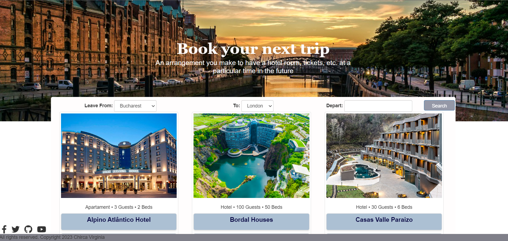

Pagină Web "Booking"

Cerinte
1. Imaginile si descrierile au fost luate de pe site-uri de specialitate / profil turistic
2. Am folosit atributul link pentru a importa fonturile și iconițele din biblioteca Font Awesome.
3. $("#depart").datepicker(); Am utilizat jQuery pentru a selecta elementul cu id-ul "depart" și apoi sa aplic funcția .datepicker() asupra acestuia, pentru afisarea selectiei pe calendar.
4. Apasarea butonului "Search" va filtra random cazarile, va ascunde 5 carduri si va lasa unul singur vizbil.
5. S-au folosit HTML 5 tags.
6. “easter egg”:Am realizat un efect de animație atunci când utilizatorul dă clic pe o imagine dintr-un element "card". Această animație are o durată de 2 secunde și utilizează o funcție de temporizare ease-in-out.rotate-and-move: Această clasă CSS este atribuită elementului  care va fi animat. Aplică animația rotateAndMove și setează punctul de origine al transformării la centrul elementului.